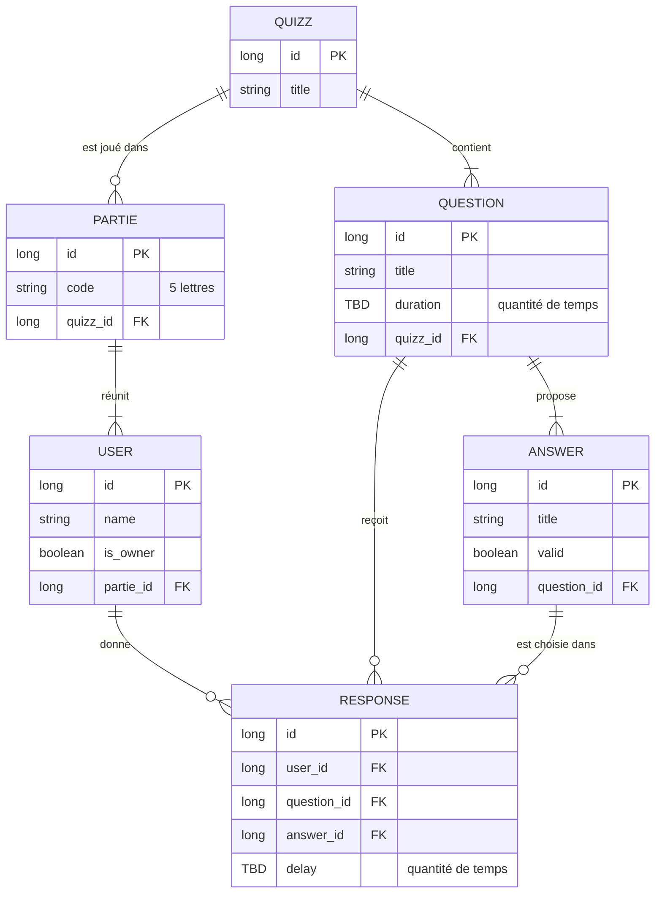

# Le Buzzer

Application de quiz en temps réel : un animateur ouvre une partie, les joueurs la rejoignent avec un code à 5 lettres, répondent aux questions, et le classement se met à jour chez tout le monde.

Stack : Spring Boot 3 (WebSocket + STOMP) côté serveur, React 18 + TypeScript strict (Vite) côté client.

---

## Lancement

> À compléter : prérequis, commandes pour lancer le backend et le frontend, ports utilisés.

---

## Modèle de données

### Schéma

### Les tables

| Table | Rôle | Colonnes |
|---|---|---|
| **Partie** | Une session de jeu | `id`, `code`, `quizz_id` |
| **Quizz** | Un questionnaire réutilisable | `id`, `title` |
| **Question** | Une question d'un quizz | `id`, `title`, `duration`, `quizz_id` |
| **Answer** | *Une* option proposée pour une question | `id`, `title`, `valid`, `question_id` |
| **User** | Un participant (joueur ou animateur) d'une partie | `id`, `name`, `is_owner`, `partie_id` |
| **Response** | Ce qu'un joueur a répondu à une question | `id`, `user_id`, `question_id`, `answer_id`, `delay` |

**Contrainte :** `UNIQUE (user_id, question_id)` sur Response.

---

## Les choix et leur justification

### 1. Pas de liste dans une colonne

Une colonne relationnelle stocke une seule valeur simple par ligne (première forme normale). Une liste se représente donc par **plusieurs lignes** dans une autre table, pas par une liste dans une case.

C'est pour ça que Partie n'a pas de `list<Player>` et que Question n'a pas de liste d'options.

### 2. La clé étrangère va du côté « plusieurs »

Règle utilisée pour chaque relation : *une ligne de X pointe vers combien de Y ?* Si « une seule », X peut porter `y_id`. Si « plusieurs », non.

| Relation | Raisonnement | Résultat |
|---|---|---|
| Quizz → Partie | Un quizz peut être joué dans plusieurs parties, une partie joue un seul quizz | Partie porte `quizz_id` |
| Quizz → Question | Un quizz a plusieurs questions | Question porte `quizz_id` |
| Question → Answer | Une question a plusieurs options | Answer porte `question_id` |
| Partie → User | Une partie réunit plusieurs users, un user appartient à une seule partie | User porte `partie_id` |

### 3. On ne stocke pas ce qu'on peut recalculer

Une donnée déduite stockée, c'est la même information à deux endroits, donc un risque d'incohérence. On garde une **seule source de vérité**.

- **Pas de table Classement.** Il se recalcule à partir des réponses.
- **Pas de `score` sur User.** C'est la somme des points de ses réponses. Avec une quinzaine de joueurs et une dizaine de questions, Response contient au maximum ~150 lignes par partie : le recalcul ne coûte rien.
- **Pas de `classement` sur Question.** Le classement d'une question se déduit de ses réponses : d'abord juste ou faux, puis par délai.
- **Pas de `valid` sur Response.** Response pointe vers l'option choisie (`answer_id`), et l'option sait déjà si elle est correcte.

### 4. Answer et Response sont deux choses différentes

- **Answer** décrit le quiz : ce sont les options proposées, préparées avant la partie. Elles ne bougent pas.
- **Response** raconte ce qui s'est passé pendant la partie : qui a répondu quoi, à quelle question, en combien de temps. C'est un **événement**, avec ses propres données (le délai).

Answer est dans une table à part de Question parce qu'une question a plusieurs options (relation 1-N).

### 5. La bonne réponse est portée par chaque option

Chaque ligne d'Answer a un booléen `valid`. Une question à plusieurs bonnes réponses a simplement plusieurs lignes à `true`. Stocker les bonnes réponses dans Question aurait demandé une liste dans une colonne.

### 6. Response pointe vers l'option choisie

Plutôt qu'un enum A/B/C/D, Response porte `answer_id` : un lien direct vers l'option choisie, ce qui permet de savoir si la réponse est juste sans rien dupliquer.

### 7. Une seule réponse par joueur et par question

Response garde `question_id` (même s'il est techniquement déductible via `answer_id`) pour pouvoir poser la contrainte `UNIQUE (user_id, question_id)`.

Pourquoi une contrainte et pas seulement une vérification dans le code : si deux réponses du même joueur arrivent en même temps (double-clic, renvoi après reconnexion), deux threads peuvent vérifier « pas encore de réponse » avant que l'un d'eux n'écrive. La vérification « je regarde, puis j'écris » se fait en deux temps ; la contrainte d'unicité est vérifiée par la base au moment de l'écriture, en un seul temps.

### 8. L'animateur est un User avec `is_owner`

Pas de compte utilisateur dans le sujet : un User naît quand il crée ou rejoint une partie, et n'existe que pour elle.

Première version envisagée : un `owner_id` dans Partie. Abandonnée car elle créait une dépendance circulaire (la partie a besoin de l'animateur, l'animateur a besoin de la partie) et doublonnait l'information.

Choix retenu : un booléen `is_owner` sur User. La partie est créée d'abord, puis l'animateur avec son `partie_id` et `is_owner = true`.

**Compromis assumé :** le schéma ne garantit plus à lui seul qu'il n'y a qu'un animateur par partie. Cette règle est portée par la **couche service** : seule l'action « créer une partie » met `is_owner` à `true`, l'action « rejoindre » le met toujours à `false`. C'est aussi le service qui vérifie que l'auteur d'un message animateur (lancer une question, clore, terminer) est bien l'owner de la partie.

---

## Points encore ouverts

- **`is_owner` ou `role` :** garder l'un des deux, pas les deux (ils disent la même chose avec deux rôles possibles).
- **Type de `duration` et `delay` :** ce sont des quantités de temps, pas des instants. Type exact et unité à choisir.
- **Réponses multiples :** si une question a plusieurs bonnes réponses, le joueur peut-il en cocher plusieurs ? Si oui, Response doit évoluer. Sinon, limiter à une bonne réponse par question est un choix de périmètre défendable (le contenu du quiz n'est pas évalué).
- **Persistance :** le sujet ne l'exige pas, une partie peut vivre en mémoire. Le modèle ci-dessus s'applique aussi à des objets Java en mémoire. Si on reste en mémoire, la règle « une seule réponse par question » doit être rendue atomique dans le service.
