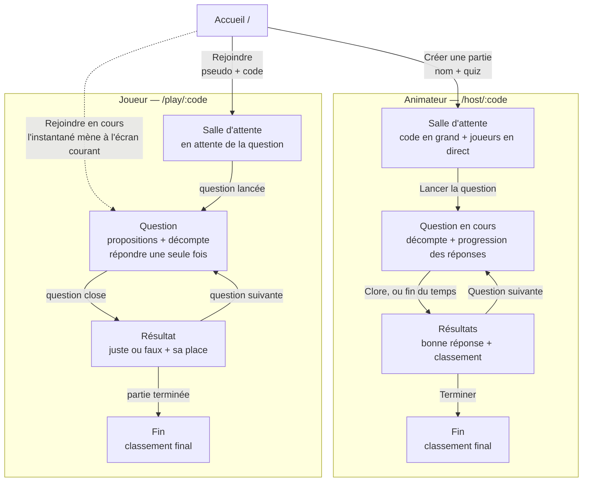

# Le Buzzer

Application de quiz en temps réel : un animateur ouvre une partie, les joueurs la rejoignent avec un code à 5 lettres, répondent aux questions, et le classement se met à jour chez tout le monde.

Stack : Spring Boot 3 (WebSocket + STOMP) côté serveur, React 18 + TypeScript strict (Vite) côté client.

---

## Lancement

> À compléter : prérequis, commandes pour lancer le backend et le frontend, ports utilisés.

# Le Buzzer — Parcours front

